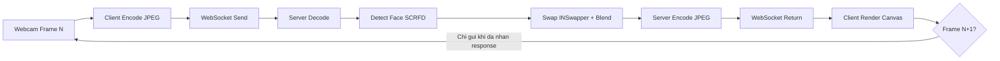
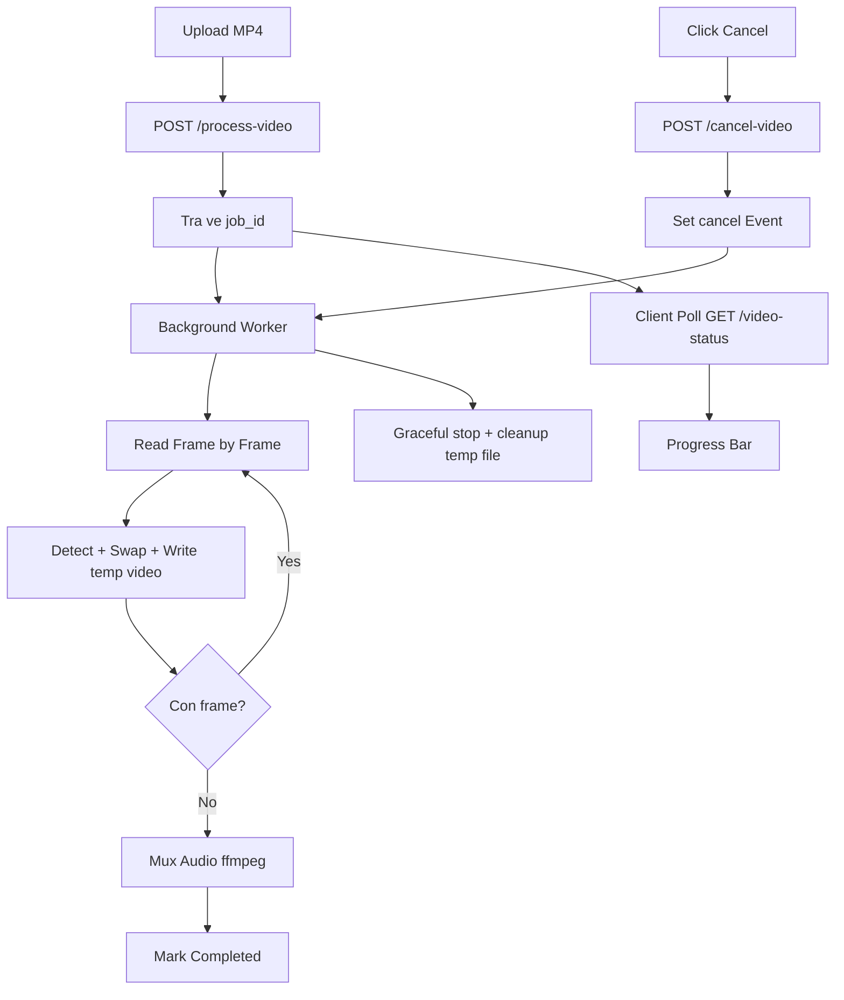
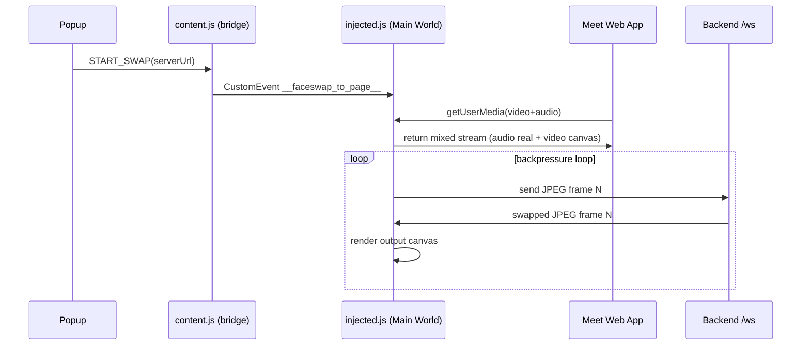

# Deepfake Research: Chạm Ngõ AI Face Swap

> Dành cho buổi technical sharing. Tập trung vào các khái niệm cốt lõi, tư duy thiết kế hệ thống và bài học kỹ thuật khi tích hợp AI models vào ứng dụng thực tế. Tối giản code, nhấn mạnh vào flow và design.

---

## 1. Deepfake là gì? Góc nhìn tổng quan
**Deepfake** là sự kết hợp giữa **Deep Learning** và **Fake** media, sử dụng mạng nề-ron nhân tạo để tổng hợp/thao túng hình ảnh, âm thanh, video sống động như thật.

**Các phân nhánh phổ biến:**
1. **Face Swap (Đổi mặt):** Lấy mặt của người A đắp lên người B trong video/ảnh (Phạm vi của project này).
2. **Face Reenactment (Khắc họa biểu cảm):** Điều khiển cử chỉ miệng, mắt, đầu của một bức ảnh tĩnh theo video của người khác (First Order Motion).
3. **Voice Cloning / Lip Sync:** Sao chép giọng nói chỉ từ vài giây audio mẫu và đồng bộ khẩu hình môi.

---

## 2. Nhập môn các thuật ngữ & Khái niệm cốt lõi

Khi tiếp cận quy trình tích hợp AI Deepfake, chúng ta sẽ bắt gặp các khái niệm sau:

*   **ONNX (Open Neural Network Exchange):** Được ví như "Docker Image dành cho AI". Nó là định dạng chuẩn giúp export model AI từ môi trường huấn luyện (PyTorch/TensorFlow) và dùng chung để chạy suy luận (Inference) trên đa dạng nền tảng phần cứng (CPU, GPU, Apple Neural Engine) mà không cần cài đặt lại môi trường gốc cồng kềnh.
*   **Face Embedding (Latent Space):** Bản "DNA kỹ thuật số" của khuôn mặt. Mạng AI sẽ nén ảnh khuôn mặt thành một vector (ví dụ mảng 512 con số). Các số này mô tả cấu trúc tự nhiên (mắt, mũi, xương hàm) bất biến và độc lập với ánh sáng hay góc nghiêng.
*   **Bounding Box & Landmarks:** Box là khung chữ nhật bao quanh một khuôn mặt. Landmarks là các điểm tọa độ chi tiết (mắt, mũi, khóe miệng) dùng để tính toán góc nghiêng và căn chỉnh mặt (Face Alignment).
*   **Alpha Blending & ROI (Region of Interest):** Lớp phủ mềm làm mờ (Feather Mask) giúp trộn mượt viền khuôn mặt nhân tạo vào ảnh thật. Chỉ áp dụng tính toán hình ảnh tại đúng một vùng nhỏ (ROI) thay vì xử lý trên toàn bộ hình ảnh lớn để tiết kiệm tối đa tài nguyên.

---

## 3. Kiến trúc Hệ thống & Luồng xử lý (Flows)

Dự án hỗ trợ hai luồng tương tác với người dùng với các mô hình quản lý process riêng biệt:

### 3.1. Luồng Real-time Face Swap (Webcam)
Đặc thù của luồng này là cần **Độ trễ rất thấp (Low Latency)**.
*   **Giao thức:** Sử dụng **WebSocket** duy trì 1 kết nối liên tục, tránh overhead sinh header/connection tốn kém của HTTP khi truyền video ở tần số 10-20 FPS.
*   **Backpressure Pattern (Request-Response Loop):** 
    Thay vì bắt Client gửi liên tục, Client sẽ gửi frame 1 $\rightarrow$ Ném vào Executor xử lý song song $\rightarrow$ Server trả kết quả $\rightarrow$ Client vẽ lên UI xong MỚI gửi tiếp frame 2. Đảm bảo server không bao giờ bị nghẽn (backlog) làm tăng dồn latency.

**Sơ đồ flow Real-time (WebSocket + Backpressure):**



### 3.2. Luồng Video Batch Processing (File MP4)
Đặc thù tốn cực kỳ nhiều thời gian xử lý từng khung hình, có thể gây đứt connection/timeout.
*   **Giao thức:** **HTTP Polling** kết hợp Background Tasks.
*   **Flow & Graceful Shutdown:**
    1. Client nạp file video. Server cấp `job_id` và bắt tay xử lý ngầm (Background Task).
    2. API `/video-status`: Trả về tiến độ hiện tại để Client tạo thanh Progress bar qua Polling.
    3. Trạng thái Cancel (Dừng): Nếu Client bấm "Dừng", gọi API Cancel truyền tín hiệu Thread Event để ngắt ngầm process OpenCV an toàn, tránh waste CPU. Kết thúc sớm luồng chèn âm thanh (FFMPEG).

**Sơ đồ flow Video Batch (HTTP Polling + Cancel Signal):**



---

## 4. Bóc tách AI Models (InsightFace)

Hệ thống kết hợp nhiều model nhẹ chạy **hoàn toàn offline/local** để bảo vệ dữ liệu khuôn mặt:

1. **SCRFD (Face Detection):** Tìm khoanh vùng vị trí khuôn mặt. Cực kỳ nhanh, phù hợp quét camera real-time.
2. **ArcFace (Face Recognition):** Trích xuất nhận diện (Face Embedding 512 số). Đặc biệt, khối lượng tính toán này chỉ dùng **1 lần duy nhất** khi người dùng tải ảnh đích lên, và lưu cache lại trên RAM (tránh tính lại thừa thãi).
3. **INSwapper (Face Swap):** Mạng sinh nội dung thực hiện trích xuất mặt người và đắp đè đặc trưng nhận diện vào.

> *Mẹo tối ưu Load:* Thư viện InsightFace sẽ mặc định load tất tần tật các thành phần như nhận diện Tuổi, Giới tính, 3D Mesh. Chủ động filter lược bỏ để chỉ nạp Detection + Recognition giúp rút ngắn **~40% thời gian** khởi động ứng dụng ban đầu.

---

## 5. Cải thiện Hiệu năng thực chiến (Performance Optimizations)

Đây là các khía cạnh tốn chi phí rực rỡ nhất để đưa dự án từ chỗ "Swap chờ gãy cổ" thành "Swap Real-time mượt".

### 5.1. Bài toán Môi trường: Docker VM vs. Local Native 🔥 (BƯỚC NGOẶT)
*   **Vấn đề:** Chạy hệ thống trên Docker ở Mac có độ trễ cực cao, FPS lẹt đẹt. Trong khi đó, phần cứng Mac (chip M-series) nổi tiếng mạnh mẽ.
*   **Nguyên nhân:** Docker Desktop cấu trúc bên dưới trên Mac và Windows là chạy thông qua một máy ảo Linux (Linux VM). ONNX Runtime bị cô lập và chỉ thấy nhân CPU x86/ARM giả lập, **không thể tiếp cận Neural Engine (ANE)** hay GPU.
*   **Giải pháp:** Gỡ Docker -> Setup môi trường **chạy Local trực tiếp qua Python ảo (venv)**. Lúc này, hệ thống kích hoạt thành công provider tăng tốc: **`CoreMLExecutionProvider` (Native Apple Silicon)**. Độ trễ tụt đáng kinh ngạc, xử lý khung hình siêu tốc và mở khóa mức FPS kỳ vọng.

### 5.2. Thuật toán Frame-skipping (Tiết kiệm xử lý)
*   **Vấn đề:** Không phải khâu nào sinh ra cũng bắt buộc chạy trên định mức 100%. Model AI "Dò tìm mặt" (Detection) rất ngốn tài nguyên và không cần chạy mỗi millisecond (đầu người ít giật cục).
*   **Giải pháp - Áp dụng Cơ chế Theo vết (Tracking) + Cache:** Chỉ yêu cầu tìm mặt **sau mỗi 5 khung hình**. Các khung hình liền kề ở giữa sử dụng tái lại kết quả tọa độ của box vừa detect, chỉ tịnh tiến rất ít. Kéo giảm mạnh mẽ mức tải lên CPU tổng thể hệ thống.

### 5.3. Custom Lightweight Blend (Cắt chi phí bọc gói)
*   **Sự thật về thư viện mở:** Đọc sâu source code OpenCV của base model phát hiện các hàm ghép nối xử lý tràn lan làm mịn trên **Toàn khung hình 480x360 pixel** (Erosion, Dilation, Gaussian Blur) gây tụt giảm hiệu suất tàn bạo trên các thiết bị không có Card đồ họa mạnh.
*   **Giải pháp (Bypass):** Chủ động can thiệp vào tham số chạy `paste_back=False`. Thay thế cơ chế mặc định bằng luồng tự tạo: tính toán cắt ghép **vừa khít trong vùng kích cỡ 128x128 pixel quanh khuôn mặt**, lưu bộ đệm các viền mờ (Feather Cache). Kết quả là nhả cả chục task dư thừa từ thư viện cho cấu hình phổ thông.

---

## 6. Bài học kinh nghiệm Đắt giá (Key Takeaways)

1. **Hiểu rõ giới hạn Tầng ảo hóa (Virtualized Environments):** Đừng vội vàng đổ lỗi do AI/Codebase khi dùng Docker mà thấy chậm. Rào cản truy cập phần cứng phân luồng cấp thấp (NPU/GPU/CoreML) từ bên trong Docker VM là vô cùng gian truân. Đối chiếu test Local là một quy trình bắt buộc trong ứng dụng AI thời gian thực.
2. **Measure First, Optimize Later (Đo lường trước, Tối ưu sau):** Tránh Optimize bằng cảm tính. Thực thi việc cắm timing/Profiling cho 4 bước (Decode, Detect, Swap, Encode) đã dẫn lối thẳng đến bước Swap tốn lượng tài nguyên khổng lồ nhất (chiếm 80%) thay vì Detect.
3. **Đừng tin mù quáng Framework (Bypass Defaults):** Tool mã nguồn mở được viết ra để có độ "bao phủ/trơn tru an toàn nhất", không phải "thời gian thực" nhất. Hiểu luồng rễ bên dưới cho phép lược bỏ tính toán dư là cách hệ thống bùng nổ hiệu năng.
4. **Kiểm soát Graceful Shutdown:** Xử lý media lớn là bài toán Background Worker. Cần thiết kế tốt các tín hiệu hủy luồng an toàn (Event Signals) cho phép break các vòng lặp tính toán nặng giúp giải phóng RAM và tránh kẹp server treo triền miên.

---

## 7. Setup System (TL;DR)

**Chạy Native trên hệ thống Local (Sử dụng CoreML - KHUYÊN DÙNG ĐỂ DEMO PERFORMANCE):**
```bash
# MacOS: Bắt buộc Python 3.11.x để tương thích mượt dependency ml-dtypes & numpy
python3.11 -m venv venv
source venv/bin/activate
pip install -r requirements.txt

# Start Server
uvicorn app.main:app --host 127.0.0.1 --port 7778 --reload
# -> Truy cập: http://localhost:7778
```

**Chạy hệ thống cấp Container (Docker - Fallback CPU):**
```bash
docker compose up --build -d
# Cổng expose tại 7777 thay vì 7778
```

---

## 8. Chrome Extension — Face Swap trên Google Meet

Mở rộng demo từ bản web sang **Chrome Extension** cho phép swap face trực tiếp trong cuộc gọi Google Meet.

### 8.1. Kiến trúc Extension

```
┌─────────────────────────────────────────────────────────┐
│  Chrome Extension (MV3)                                 │
│                                                         │
│  ┌──────────┐    messages    ┌──────────────────────┐  │
│  │  Popup   │ ◄────────────► │  content.js (bridge) │  │
│  │ (UI/UX)  │                │  Isolated World      │  │
│  └──────────┘                └──────────┬───────────┘  │
│                                         │ inject        │
│                              ┌──────────▼───────────┐   │
│                              │ injected.js          │   │
│                              │ Main World           │   │
│                              │ Override getUserMedia│   │
│                              │ Return canvas stream │   │
│                              └──────────┬───────────┘   │
│                                         │               │
└─────────────────────────────────────────┼───────────────┘
                                          │ WebSocket
                                          ▼
                              ┌──────────────────────┐
                              │  FastAPI Backend      │
                              │  SCRFD → inswapper    │
                              └──────────────────────┘
```

### 8.2. Cơ chế hoạt động (Key Concepts)

1. **Main World Injection:** `content.js` chỉ làm bridge. Logic can thiệp browser API nằm trong `injected.js` (Main World) để override thật sự `navigator.mediaDevices.getUserMedia`.
2. **Proxy Stream Pattern:** Khi Meet gọi camera, extension vẫn lấy webcam thật nhưng **trả về stream từ `canvas.captureStream()`**. Vì vậy self-preview và remote stream cùng đọc từ một nguồn đã swap.
3. **Canvas Pipeline:** Webcam thật → hidden `<video>` → capture lên `<canvas>` → gửi qua WebSocket → nhận frame đã swap → vẽ lại lên output canvas.
4. **Backpressure giữ nguyên:** Chỉ gửi frame mới sau khi nhận response từ server, tránh WS backlog.
5. **Aspect Ratio Consistency:** Chuẩn hóa cùng tỉ lệ khung hình giữa webcam input và canvas output (ví dụ 4:3) để tránh méo mặt làm giảm chất lượng detect/embedding.

### 8.4. Sơ đồ luồng Extension (End-to-End)



---

## 9. Context Pack cho Notebook LLM (Generate Slide)

Đây là phần tóm tắt ngữ cảnh để model slide nắm đúng trọng tâm kỹ thuật, tránh tạo nội dung quá chung chung.

### 9.1. Problem Statement
1. Mục tiêu: Face swap real-time cho webcam và batch processing cho video MP4.
2. Ràng buộc: Chạy local/offline, bảo vệ dữ liệu khuôn mặt, độ trễ thấp đủ dùng cho demo meeting.
3. Thách thức chính: Trade-off giữa chất lượng hình, FPS và độ ổn định kết nối.

### 9.2. Core Decisions
1. Chọn ONNX Runtime + InsightFace để chạy đa nền tảng, giảm phụ thuộc training stack.
2. Chọn WebSocket + backpressure cho real-time để tránh queue tích lũy latency.
3. Chọn HTTP Polling + Background Task cho batch để tránh timeout.
4. Chọn local native (CoreML provider) thay vì Docker khi demo hiệu năng trên Mac.

### 9.3. Performance Narrative (dùng cho storytelling slide)
1. Trước tối ưu: pipeline bị nghẽn ở bước swap/blend, latency cao, FPS thấp.
2. Sau tối ưu: giảm tác vụ dư, cache embedding, frame-skipping detection, cải thiện rõ latency/FPS.
3. Bài học: đo lường từng stage (Decode, Detect, Swap, Encode) quan trọng hơn tối ưu cảm tính.

### 9.4. Failure Cases cần nêu trong slide
1. Môi trường Docker VM không truy cập được ANE/GPU như local native.
2. Mismatch color space hoặc aspect ratio gây giảm độ giống source face.
3. Xử lý thiếu graceful cancel ở batch dễ gây treo worker và rò tài nguyên.

### 9.5. Demo Script gợi ý (5-7 phút)
1. Giới thiệu 2 luồng xử lý và lý do tách kiến trúc.
2. Chạy real-time demo, hiển thị metrics panel.
3. Chạy batch demo với progress + cancel.
4. So sánh nhanh local native và Docker CPU fallback.
5. Kết bằng 4 bài học kinh nghiệm và roadmap.

### 9.6. Roadmap đề xuất
1. Thêm quality profile (Fast/Balanced/High Quality).
2. Hỗ trợ adaptive resolution theo tải máy.
3. Cải thiện temporal consistency giữa các frame để giảm nhấp nháy.
4. Mở rộng extension cho nhiều nền tảng web meeting/chat một cách ổn định.

### 9.7. Benchmark Template (điền số trước khi generate slide)

| Scenario | Resolution | Provider | Avg Latency (ms) | Avg FPS | Note |
|---|---|---|---:|---:|---|
| Web Real-time (Before) | 480x360 | CPU | TBD | TBD | Baseline trước tối ưu |
| Web Real-time (After) | 480x360 | CoreML | TBD | TBD | Sau cache + blend + backpressure |
| Extension (Before) | 640x480 | CPU/CoreML | TBD | TBD | Chưa chuẩn hóa aspect ratio |
| Extension (After) | 480x360 | CPU/CoreML | TBD | TBD | Đã chuẩn hóa input/output ratio |
| Batch MP4 | Source video | CPU/CoreML | TBD | N/A | Đo tổng thời gian job |

### 8.3. Cách cài đặt & sử dụng

```bash
# 1. Chạy backend server (bắt buộc)
source venv/bin/activate
uvicorn app.main:app --host 127.0.0.1 --port 7778 --reload

# 2. Load extension vào Chrome
#    → chrome://extensions → Bật "Developer mode"
#    → "Load unpacked" → chọn thư mục chrome-extension/

# 3. Mở Google Meet → Click icon extension
#    → Upload source face → Bấm "Bắt đầu Swap"
```
