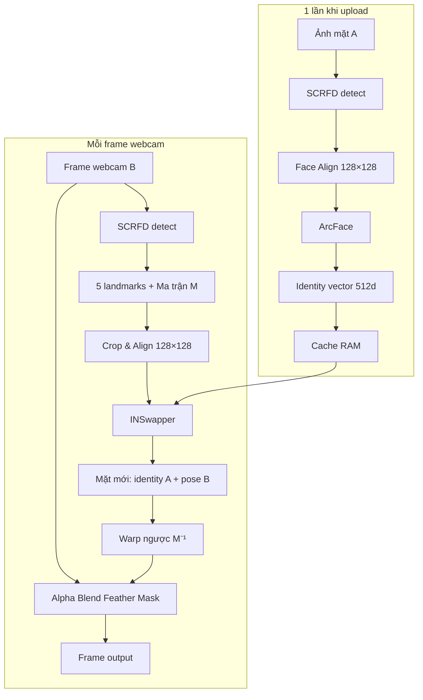
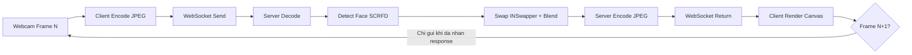
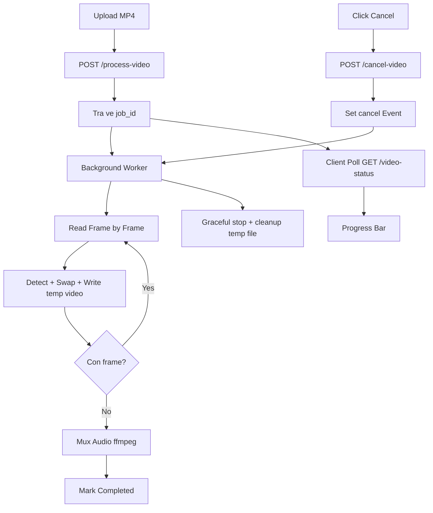
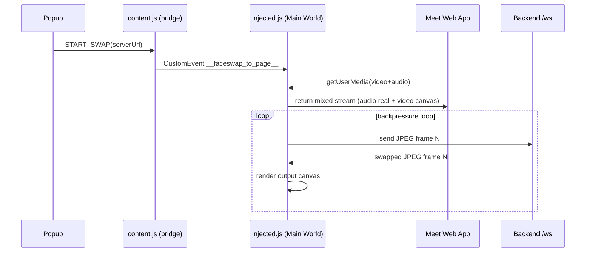

# Deepfake Research: Chạm Ngõ AI Face Swap

> Dành cho buổi technical sharing. Tập trung vào các khái niệm cốt lõi, tư duy thiết kế hệ thống và bài học kỹ thuật khi tích hợp AI models vào ứng dụng thực tế. Tối giản code, nhấn mạnh vào flow và design.

---

## 1. Deepfake là gì? Góc nhìn tổng quan
**Deepfake** là sự kết hợp giữa **Deep Learning** và **Fake** media, sử dụng mạng neural nhân tạo để tổng hợp/thao túng hình ảnh, âm thanh, video sống động như thật.

**Các phân nhánh phổ biến:**
1. **Face Swap (Đổi mặt):** Lấy mặt của người A đắp lên người B trong video/ảnh (Phạm vi của project này).
2. **Face Reenactment (Khắc họa biểu cảm):** Điều khiển cử chỉ miệng, mắt, đầu của một bức ảnh tĩnh theo video của người khác (First Order Motion).
3. **Voice Cloning / Lip Sync:** Sao chép giọng nói chỉ từ vài giây audio mẫu và đồng bộ khẩu hình môi.

---

## 2. Nhập môn các thuật ngữ & Khái niệm cốt lõi

Khi tiếp cận quy trình tích hợp AI Deepfake, chúng ta sẽ bắt gặp các khái niệm sau:

*   **ONNX (Open Neural Network Exchange):** Được ví như "Docker Image dành cho AI". Nó là định dạng chuẩn giúp export model AI từ môi trường huấn luyện (PyTorch/TensorFlow) và dùng chung để chạy suy luận (Inference) trên đa dạng nền tảng phần cứng (CPU, GPU, Apple Neural Engine) mà không cần cài đặt lại môi trường gốc cồng kềnh.
*   **Face Embedding (Latent Space):** Bản "DNA kỹ thuật số" của khuôn mặt. Mạng AI sẽ nén ảnh khuôn mặt thành một vector (ví dụ mảng 512 con số). Các số này mô tả cấu trúc tự nhiên (mắt, mũi, xương hàm) bất biến và độc lập với ánh sáng hay góc nghiêng.
*   **Bounding Box & Landmarks:** Box là khung chữ nhật bao quanh một khuôn mặt. Landmarks là các điểm tọa độ chi tiết (mắt, mũi, khóe miệng) dùng để tính toán góc nghiêng và căn chỉnh mặt (Face Alignment).
*   **Alpha Blending & ROI (Region of Interest):** Lớp phủ mềm làm mờ (Feather Mask) giúp trộn mượt viền khuôn mặt nhân tạo vào ảnh thật. Chỉ áp dụng tính toán hình ảnh tại đúng một vùng nhỏ (ROI) thay vì xử lý trên toàn bộ hình ảnh lớn để tiết kiệm tối đa tài nguyên.

---

## 3. Cơ chế AI: Từ mặt A sang mặt B

Đây là phần cốt lõi nhất. Toàn bộ pipeline gồm **4 bước tuần tự**, thực hiện mỗi frame webcam:

### 3.1. Bước 1 — Source Face Encoding (thực hiện 1 lần duy nhất)

Khi người dùng upload ảnh mặt nguồn (người A), hệ thống cần trích xuất "danh tính" của khuôn mặt đó thành dạng toán học:

1. **SCRFD phát hiện mặt** trong ảnh, trả về 5 landmark points (2 mắt, mũi, 2 khóe miệng).
2. **Face Alignment:** Dựa vào 5 điểm đó, tính ma trận biến đổi affine để chuẩn hóa khuôn mặt về **128×128 pixel** — chuẩn "ảnh hộ chiếu" thẳng nhìn thẳng, bất kể góc nghiêng ban đầu.
3. **ArcFace mã hóa** ảnh đã chuẩn hóa thành **vector 512 chiều** — đây là "DNA kỹ thuật số" của mặt A. Vector này mô tả cấu trúc xương hàm, khoảng cách mắt, đường nét mũi... bất biến với ánh sáng hay góc nghiêng.
4. **Cache lại vector đó.** Bước 1 chỉ chạy 1 lần khi upload, không lặp lại mỗi frame.

```
Ảnh mặt A  →  SCRFD (detect)  →  Face Align 128×128  →  ArcFace  →  vector[512]  →  Cache RAM
```

### 3.2. Bước 2 — Target Face Alignment (mỗi frame)

Với mỗi frame webcam (người B đang ngồi trước camera):

1. **SCRFD quét frame** để tìm vị trí khuôn mặt B, lấy 5 landmarks.
2. **Tính ma trận affine M** để cắt và chuẩn hóa mặt B → **128×128** (cùng chuẩn với bước 1).
3. **Lưu lại ma trận M** để dùng ở bước 4 (warp ngược).

```
Frame webcam B  →  SCRFD  →  5 landmarks  →  Affine Matrix M  →  Crop 128×128 chuẩn hóa
```

### 3.3. Bước 3 — INSwapper: Sinh khuôn mặt mới (trọng tâm)

Đây là model AI quan trọng nhất. INSwapper là một **mạng sinh ảnh có điều kiện** (conditional generative network):

*   **Đầu vào:** Ảnh 128×128 của mặt B (đã chuẩn hóa) + vector identity[512] của mặt A
*   **Đầu ra:** Ảnh 128×128 — khuôn mặt **mang danh tính A** nhưng giữ nguyên **pose, biểu cảm, góc nhìn của B**

> **Analogy:** Hãy tưởng tượng một diễn viên (B) đang đeo một chiếc mặt nạ được đúc hoàn hảo theo khuôn mặt A — nhưng mặt nạ đó vẫn nhếch miệng cười, nhíu mày, hay quay đầu theo đúng chuyển động của diễn viên.

INSwapper không "copy-paste" pixel của mặt A. Nó **học cách tái tạo lại mặt A** từ vector identity, sau đó áp dụng vào hình dạng/góc của mặt B.

```
     ┌─── identity vector[512] (mặt A) ────────────┐
     │                                              ▼
Mặt B 128×128  ──────────────────────────►  INSwapper  ──►  Mặt mới 128×128
(pose/expression của B)                              (identity của A, pose của B)
```

### 3.4. Bước 4 — Warp ngược + Alpha Blend

Mặt mới 128×128 cần được dán trở lại đúng vị trí trên frame gốc:

1. **Inverse Affine M⁻¹:** Biến đổi ngược lại để đưa ảnh 128×128 về đúng kích thước, góc, vị trí trong frame.
2. **Feather Mask (Alpha Blend):** Dùng mask gradient mờ dần ở rìa để hoà tan mượt viền mặt mới vào nền ảnh thật. Không có viền cứng.
3. **Blend chỉ trong ROI** (vùng nhỏ quanh mặt), không xử lý toàn khung hình.

```
Mặt mới 128×128  →  Warp M⁻¹  →  Blend với Feather Mask  →  Frame output
```

### 3.5. Sơ đồ tổng thể pipeline



---

## 4. Bóc tách AI Models (InsightFace)

Hệ thống kết hợp nhiều model nhẹ chạy **hoàn toàn offline/local** để bảo vệ dữ liệu khuôn mặt:

1. **SCRFD (Face Detection):** Tìm vị trí khuôn mặt và 5 landmark points. Cực kỳ nhanh, phù hợp quét camera real-time.
2. **ArcFace (Face Recognition):** Trích xuất Face Embedding 512 chiều. Chỉ tính **1 lần khi upload source face**, cache lại RAM.
3. **INSwapper (Face Swap):** Mạng sinh ảnh có điều kiện — nhận identity embedding + aligned face → sinh khuôn mặt mới.

> *Mẹo tối ưu Load:* InsightFace mặc định load thêm cả nhận diện Tuổi, Giới tính, 3D Mesh. Chủ động filter chỉ nạp Detection + Recognition giúp giảm **~40% thời gian** khởi động.

---

## 5. Kiến trúc Hệ thống & Luồng xử lý

Dự án hỗ trợ hai luồng với mô hình giao tiếp khác nhau:

### 5.1. Luồng Real-time (Webcam)
**WebSocket** duy trì kết nối liên tục, client chỉ gửi frame mới sau khi nhận response — tránh queue tích lũy latency.

**Sơ đồ flow Real-time (WebSocket + Backpressure):**



### 5.2. Luồng Video Batch (File MP4)
**HTTP Polling** + Background Task để tránh timeout. Server cấp `job_id`, client poll tiến độ, hỗ trợ cancel an toàn.

**Sơ đồ flow Video Batch (HTTP Polling + Cancel Signal):**



---

## 6. Cải thiện Hiệu năng thực chiến (Performance Optimizations)

Đây là các khía cạnh tốn chi phí rực rỡ nhất để đưa dự án từ chỗ "Swap chờ gãy cổ" thành "Swap Real-time mượt".

### 5.1. Bài toán Môi trường: Docker VM vs. Local Native 🔥 (BƯỚC NGOẶT)
*   **Vấn đề:** Chạy hệ thống trên Docker ở Mac có độ trễ cực cao, FPS lẹt đẹt. Trong khi đó, phần cứng Mac (chip M-series) nổi tiếng mạnh mẽ.
*   **Nguyên nhân:** Docker Desktop cấu trúc bên dưới trên Mac và Windows là chạy thông qua một máy ảo Linux (Linux VM). ONNX Runtime bị cô lập và chỉ thấy nhân CPU x86/ARM giả lập, **không thể tiếp cận Neural Engine (ANE)** hay GPU.
*   **Giải pháp:** Gỡ Docker -> Setup môi trường **chạy Local trực tiếp qua Python ảo (venv)**. Lúc này, hệ thống kích hoạt thành công provider tăng tốc: **`CoreMLExecutionProvider` (Native Apple Silicon)**. Độ trễ tụt đáng kinh ngạc, xử lý khung hình siêu tốc và mở khóa mức FPS kỳ vọng.

### 5.2. Thuật toán Frame-skipping (Tiết kiệm xử lý)
*   **Vấn đề:** Không phải khâu nào sinh ra cũng bắt buộc chạy trên định mức 100%. Model AI "Dò tìm mặt" (Detection) rất ngốn tài nguyên và không cần chạy mỗi millisecond (đầu người ít giật cục).
*   **Giải pháp - Áp dụng Cơ chế Theo vết (Tracking) + Cache:** Chỉ yêu cầu tìm mặt **sau mỗi 5 khung hình**. Các khung hình liền kề ở giữa sử dụng tái lại kết quả tọa độ của box vừa detect, chỉ tịnh tiến rất ít. Kéo giảm mạnh mẽ mức tải lên CPU tổng thể hệ thống.

### 5.3. Custom Lightweight Blend (Cắt chi phí bọc gói)
*   **Sự thật về thư viện mở:** Đọc sâu source code OpenCV của base model phát hiện các hàm ghép nối xử lý tràn lan làm mịn trên **Toàn khung hình 480x360 pixel** (Erosion, Dilation, Gaussian Blur) gây tụt giảm hiệu suất tàn bạo trên các thiết bị không có Card đồ họa mạnh.
*   **Giải pháp (Bypass):** Chủ động can thiệp vào tham số chạy `paste_back=False`. Thay thế cơ chế mặc định bằng luồng tự tạo: tính toán cắt ghép **vừa khít trong vùng kích cỡ 128x128 pixel quanh khuôn mặt**, lưu bộ đệm các viền mờ (Feather Cache). Kết quả là nhả cả chục task dư thừa từ thư viện cho cấu hình phổ thông.

---

## 7. Bài học kinh nghiệm Đắt giá (Key Takeaways)

1. **Hiểu rõ giới hạn Tầng ảo hóa (Virtualized Environments):** Đừng vội vàng đổ lỗi do AI/Codebase khi dùng Docker mà thấy chậm. Rào cản truy cập phần cứng phân luồng cấp thấp (NPU/GPU/CoreML) từ bên trong Docker VM là vô cùng gian truân. Đối chiếu test Local là một quy trình bắt buộc trong ứng dụng AI thời gian thực.
2. **Measure First, Optimize Later (Đo lường trước, Tối ưu sau):** Tránh Optimize bằng cảm tính. Thực thi việc cắm timing/Profiling cho 4 bước (Decode, Detect, Swap, Encode) đã dẫn lối thẳng đến bước Swap tốn lượng tài nguyên khổng lồ nhất (chiếm 80%) thay vì Detect.
3. **Đừng tin mù quáng Framework (Bypass Defaults):** Tool mã nguồn mở được viết ra để có độ "bao phủ/trơn tru an toàn nhất", không phải "thời gian thực" nhất. Hiểu luồng rễ bên dưới cho phép lược bỏ tính toán dư là cách hệ thống bùng nổ hiệu năng.
4. **Kiểm soát Graceful Shutdown:** Xử lý media lớn là bài toán Background Worker. Cần thiết kế tốt các tín hiệu hủy luồng an toàn (Event Signals) cho phép break các vòng lặp tính toán nặng giúp giải phóng RAM và tránh kẹp server treo triền miên.

---

## 8. Setup System (TL;DR)

**Chạy Native trên hệ thống Local (Sử dụng CoreML - KHUYÊN DÙNG ĐỂ DEMO PERFORMANCE):**
```bash
# MacOS: Bắt buộc Python 3.11.x để tương thích mượt dependency ml-dtypes & numpy
python3.11 -m venv venv
source venv/bin/activate
pip install -r requirements.txt

# Start Server
uvicorn app.main:app --host 127.0.0.1 --port 7777 --reload
# -> Truy cập: http://localhost:7777
```

**Chạy hệ thống cấp Container (Docker - Fallback CPU):**
```bash
docker compose up --build -d
# Cổng expose tại 7777 thay vì 7777
```

---

## 9. Chrome Extension — Face Swap trên Google Meet

Mở rộng demo từ bản web sang **Chrome Extension** cho phép swap face trực tiếp trong cuộc gọi Google Meet.

### 8.1. Kiến trúc Extension

```
┌─────────────────────────────────────────────────────────┐
│  Chrome Extension (MV3)                                 │
│                                                         │
│  ┌──────────┐    messages    ┌──────────────────────┐  │
│  │  Popup   │ ◄────────────► │  content.js (bridge) │  │
│  │ (UI/UX)  │                │  Isolated World      │  │
│  └──────────┘                └──────────┬───────────┘  │
│                                         │ inject        │
│                              ┌──────────▼───────────┐   │
│                              │ injected.js          │   │
│                              │ Main World           │   │
│                              │ Override getUserMedia│   │
│                              │ Return canvas stream │   │
│                              └──────────┬───────────┘   │
│                                         │               │
└─────────────────────────────────────────┼───────────────┘
                                          │ WebSocket
                                          ▼
                              ┌──────────────────────┐
                              │  FastAPI Backend      │
                              │  SCRFD → inswapper    │
                              └──────────────────────┘
```

### 8.2. Cơ chế hoạt động (Key Concepts)

1. **Main World Injection:** `content.js` chỉ làm bridge. Logic can thiệp browser API nằm trong `injected.js` (Main World) để override thật sự `navigator.mediaDevices.getUserMedia`.
2. **Proxy Stream Pattern:** Khi Meet gọi camera, extension vẫn lấy webcam thật nhưng **trả về stream từ `canvas.captureStream()`**. Vì vậy self-preview và remote stream cùng đọc từ một nguồn đã swap.
3. **Canvas Pipeline:** Webcam thật → hidden `<video>` → capture lên `<canvas>` → gửi qua WebSocket → nhận frame đã swap → vẽ lại lên output canvas.
4. **Backpressure giữ nguyên:** Chỉ gửi frame mới sau khi nhận response từ server, tránh WS backlog.
5. **Aspect Ratio Consistency:** Chuẩn hóa cùng tỉ lệ khung hình giữa webcam input và canvas output (ví dụ 4:3) để tránh méo mặt làm giảm chất lượng detect/embedding.

### 8.4. Sơ đồ luồng Extension (End-to-End)



---

## 10. Context Pack cho Notebook LLM (Generate Slide)

### Problem Statement
- Face swap real-time (webcam) + batch (MP4), chạy offline, bảo vệ dữ liệu khuôn mặt.
- Trade-off chính: chất lượng ảnh vs FPS vs độ ổn định kết nối.

### Slide Structure gợi ý
1. Deepfake là gì — phân nhánh
2. Cơ chế AI: 4 bước A→B (pipeline diagram)
3. 3 Models: SCRFD / ArcFace / INSwapper
4. Kiến trúc hệ thống: Real-time vs Batch
5. Tối ưu hiệu năng (Docker vs CoreML, frame-skip, custom blend)
6. Key Takeaways
7. Demo + Roadmap

### Benchmark Template (điền số trước khi generate slide)

| Scenario | Provider | Avg Latency (ms) | Avg FPS |
|---|---|---:|---:|
| Real-time — trước tối ưu | CPU (Docker) | TBD | TBD |
| Real-time — sau tối ưu | CoreML (local) | TBD | TBD |
| Batch MP4 | CoreML (local) | TBD (total job) | N/A |

### Roadmap
1. Quality profile (Fast / Balanced / High Quality)
2. Temporal consistency để giảm nhấp nháy giữa frames
3. Adaptive resolution theo tải máy
4. Mở rộng extension đa nền tảng (Zalo, Messenger)

### 8.3. Cách cài đặt & sử dụng

```bash
# 1. Chạy backend server (bắt buộc)
source venv/bin/activate
uvicorn app.main:app --host 127.0.0.1 --port 7777 --reload

# 2. Load extension vào Chrome
#    → chrome://extensions → Bật "Developer mode"
#    → "Load unpacked" → chọn thư mục chrome-extension/

# 3. Mở Google Meet → Click icon extension
#    → Upload source face → Bấm "Bắt đầu Swap"
```
